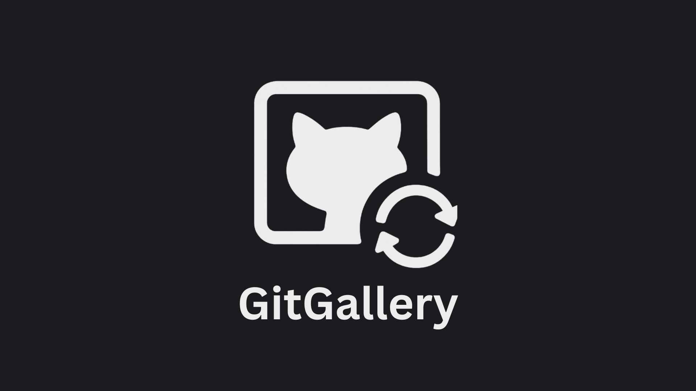

<p align="center">
	
</p>

<p align="center">
	<a href="https://github.com/Sumit189/GitGallery-OSS/releases"></a>
	<a href="https://github.com/Sumit189/GitGallery-OSS/stargazers"></a>
	
	
</p>

# GitGallery

GitGallery is a privacy-first photo vault that stores your memories securely in your own GitHub repository.
No third-party servers, no data mining, no ads. Just you, your device, and GitHub.

Your photos are version-controlled, encrypted, and fully owned by you. Whether you're backing up personal photos or building a digital journal, GitGallery keeps your data safe and accessible.

Built with Expo and React Native, the app currently targets Android with a cross-platform foundation ready for future iOS and web releases.

Core principles: Ownership, Transparency, and Privacy by Design.

## Behind the Build
[F*** DB: How I built a photo gallery using GitHub as storage](https://medium.com/@sumit-paul/f-k-db-how-i-built-a-photo-gallery-using-github-as-storage-baa8bef275f8)

## Downloads

You can get GitGallery in two ways:

**Option 1: Build it yourself** - Follow the [Building a Release](#building-a-release) instructions below to create your own APK. This is free but requires some setup.

**Option 2: Get it from Play Store** - Skip the hassle and support the project by purchasing it at a minimal price from Google Play.

<p align="center">
	<a href="https://play.google.com/store/apps/details?id=com.placeholder.gitgallery">
		
	</a>
</p>
<p align="center"><em>Your Play Store purchase keeps the project sustainable and funds ongoing development.</em></p>

## Why GitGallery?
- Own your storage: photos live in your private GitHub repo instead of someone else’s cloud.
- Familiar tooling: Git history, pull requests, and Actions can automate your media backups.
- Thoughtful UX: modern UI with dark/light themes, album filters, and clear sync states.
- Offline friendly: a local queue and SQLite cache keep track of work even when the network drops.

## Features at a Glance
- GitHub Device Flow sign-in - no personal access tokens to copy/paste.
- Guided repo setup that can create a fresh private repository for you.
- Local ↔ cloud gallery views so you can browse device photos or the repo-backed library.
- Selective album syncing with optional auto-delete after successful uploads.
- Job queue with resumable uploads, retry handling, and conflict detection (requires app to be open).
- Repo maintenance actions, including an optional clean‑slate reset that rewrites history (explicit opt‑in with double confirmation; use with caution).

## Getting Started

### Requirements
- Node.js 18 or newer and npm 9+.
- Expo CLI (`npm install -g expo-cli`) if you prefer the classic developer menu.
- A GitHub account capable of creating private repositories.

### Local Setup
1. Clone the repo and install dependencies:
	```sh
	git clone https://github.com/Sumit189/GitGallery.git
	cd GitGallery
	npm install
	```
2. Create a GitHub OAuth app (Device Flow enabled) and note the Client ID. Scope should allow repo access.
3. Provide the Client ID to the app at runtime using the Expo public env var:
	- Easiest (one-off):
		```sh
		EXPO_PUBLIC_GITHUB_CLIENT_ID=<your_client_id> npx expo start
		```
	- Or set it in `eas.json` under the build profile you use (see below) so local runs via EAS CLI inherit it.
4. Ensure your `app.json` contains your EAS project ID at `expo.extra.eas.projectId`. You can find this in the EAS Dashboard or after running `eas project:init`.
5. Start the project with `npx expo start`, then launch on Android or the web preview.
6. On first launch, sign in with GitHub, pick (or create) a private repo, and choose which albums should auto-sync.

### Building a Release
- Make sure `EXPO_PUBLIC_GITHUB_CLIENT_ID` is set in `eas.json` for the profile you will use (e.g., `production`). Example:
	```json
	{
	  "build": {
	    "production": {
	      "env": {
	        "EXPO_PUBLIC_GITHUB_CLIENT_ID": "<your_client_id>"
	      }
	    }
	  }
	}
	```
- Ensure `app.json` includes your EAS project ID at `expo.extra.eas.projectId`.
- Run a build:
	```sh
	eas build --platform android --profile production
	```
- Artifacts will be available in the EAS dashboard once the build completes.

## How Sync Works
- **On-device index**: a lightweight SQLite store remembers every asset fingerprint, upload status, and last-known SHA.
- **Job queue**: uploads, deletions, and downloads run through a serialized queue so the UI stays responsive.
- **GitHub bridge**: Octokit handles file pushes, branch resets, and content downloads against your chosen repo.
- **Metadata mirror**: a meta index inside the repo lets the app fetch cloud thumbnails quickly without downloading originals.
- **Recovery tools**: auto-sync blocklists, repo resets, and cache clears help recover from API hiccups without nuking the app.

## Roadmap & Ideas
- Background sync triggers (App Clips / Headless JS) once platforms allow it.
- End-to-end encryption for assets before they leave the device.
- Video support and higher throughput batching for large libraries.
- Share-sheet shortcut to push a single freshly-snapped photo to GitHub.

Suggestions live in the issue tracker-feel free to propose others.

## Contributing
- Check open issues or start a discussion before tackling big changes.
- Keep pull requests focused; it makes review easier for everyone.
- Use `npx expo start` for local testing and verify both local and cloud gallery modes before submitting.
- If you touch sync logic, include notes on failure scenarios you exercised.

## Community & Support
- File bugs and feature requests via GitHub Issues.
- If you ship something cool (actions workflows, automations, etc.), link it in a discussion so others can learn from it.

## License
Released under the MIT License.
